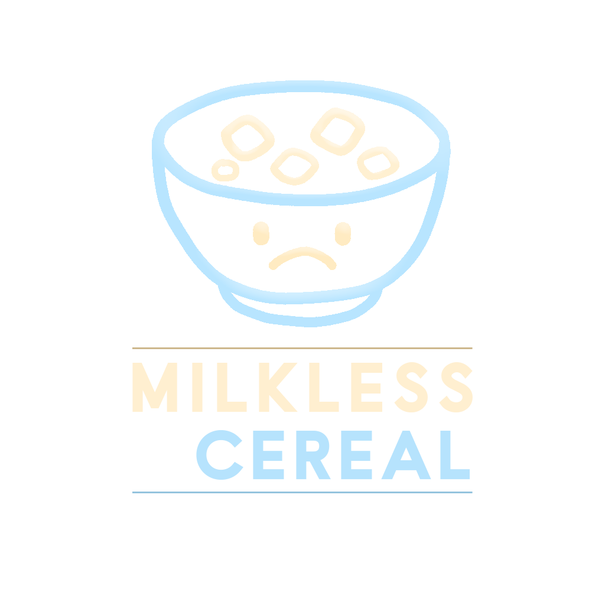
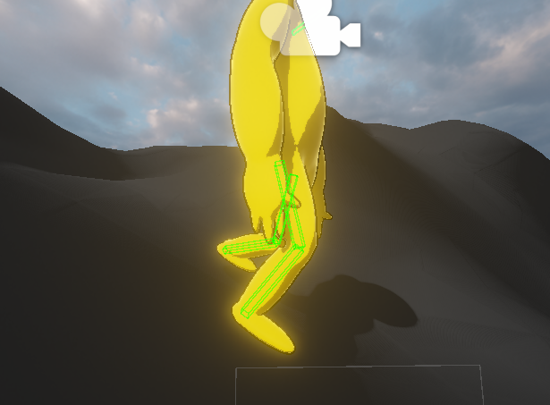
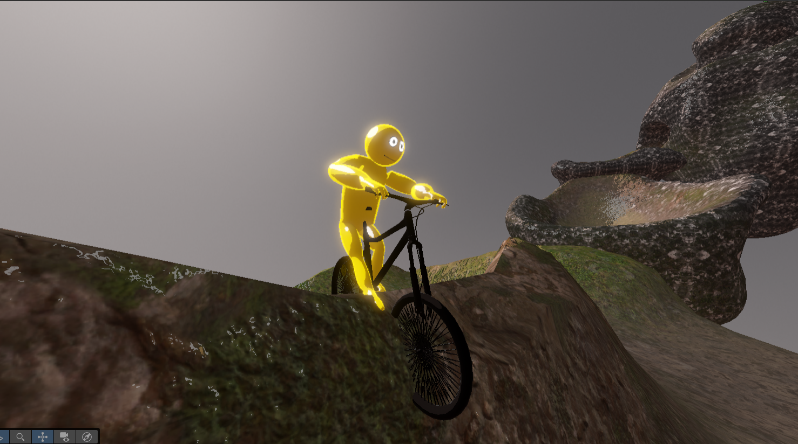
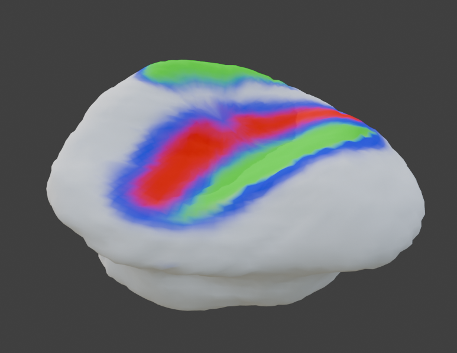
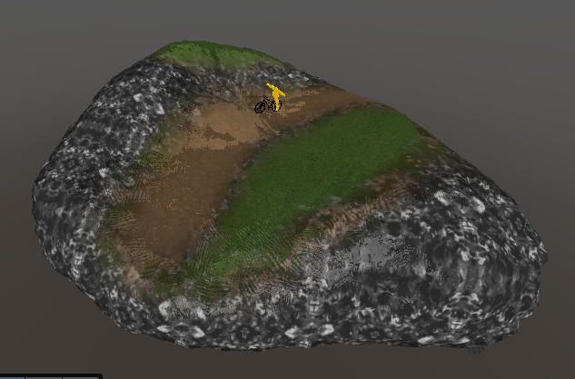
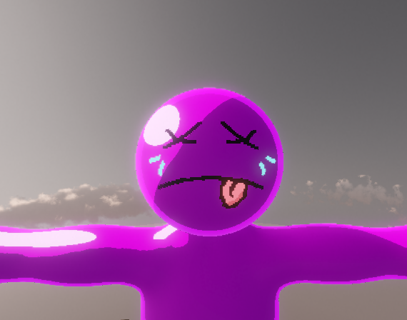

# Mountain Biking Game

*150% speed*

 

A physics-driven mountain biking game set on floating islands in the
clouds. Reach the bottom. Try not to die.

The opposite of Peak. Instead of climbing, you descend.

## Development

- Dylan Strong - Lead Developer (core systems, lead)

- Cooper Horne - Developer (basic tasks, early development)

- Quinn Deboer - Music and Sound
  
*A Milkless Cereal Studios project.*

 

## Technical Systems

### Dual Physics Architecture

The game runs two separate physics systems simultaneously.

  

  

The rider is a full active ragdoll driven by a regularly animated ghost
rig. Joints apply forces to match the ghost animation in real-time,
producing natural movement that reacts physically to impacts. Hit the
ground too hard and you'll biff it (on the bike or off of it)

  

The bike is based on a heavily modified version of Rayzngames' Simple
Bike Controller, rebuilt to handle real mountain trail conditions. Air
controls, downforce, and assist mechanics were all implemented manually.

Tires use a modified Unity WheelCollider with custom physics forces to prevent issues with clipping that emerge from a 1D raycast system such as Unity's.

### Emergent Behaviours

  

Landing stability, and nearly everything else, is not explicitly programmed. The bike naturally
stabilizes when both tires align with the surface normal on landing,
an emergent property of the underlying physics simulation.
 

  

Alongside other emergent behaviours such as wheelies when going up an intense incline (requires feathering the input to avoid flipping)

Emergent behaviour from physical constraints and rules were central in the development of the project.

### Vertex Color Terrain Blending
 
 
Custom shader work allows terrain to be authored directly in Blender
using vertex colors (R/G/B/W channels) to blend between surface
textures. This bypasses Unity's terrain system entirely, giving full
control over the island geometry while keeping the workflow in Blender, and taking advantage of triplanar mapping for proper UV calculations.

This was done to achieve floating islands, tunnels, and more, that a terrain system like Unity's cannot offer out of the box.

## Notable
 
Quinn and I used to run speedruns on each iteration of the game.
On one run, Quinn completed the entire course without the bike. (Fully with the active ragdoll)

## Status

Single player demo. Project is cancelled, but still a great learning experience.

 Multiplayer, a full map, and more features were planned but not implemented.